# INVETKER

INVETKER is a beginner-friendly application designed to make stock tracking simple and accessible through an intuitive, user-friendly interface. It enables users to manually add, update, and delete transactions, monitor real-time portfolio performance, and track favorite tickers with ease. Users can also access essential market data and financial news—all in one place—while interacting with other users by sharing comments and insights.

## Features

- 🔍 Real-time U.S. stock news and top holdings overview
- 📈 Comprehensive portfolio management with detailed P&L reports and performance metrics
- ✍️ Transaction history with manual add, update, and delete functionality
- ⭐ Favorites list for quick and easy stock monitoring
- ⚙️ Customizable user settings, including profile, language, and theme preferences
- 🌐 Multi-language support (English, Traditional Chinese, Simplified Chinese, Hindi, and more)
- 🌙 Light and dark mode themes for personalized appearance
- 💬 Social interaction features, including the ability to comment and engage with other users

## Tech Stack

- **React Native (Expo)**
  Cross-platform framework for building native mobile apps with fast development cycles.

- **TypeScript**
  A statically typed superset of JavaScript that improves code quality and developer experience.

- **Firebase (Authentication & Database)**
  Handles user authentication and stores real-time transactional and profile data securely.

- **Ant Design Mobile RN**
  UI component library used for building consistent and responsive mobile interfaces.

- **i18next**
  Internationalization framework supporting multiple languages including English, Traditional Chinese, Simplified Chinese, and Hindi.

- **Moment.js**
  Library used for parsing, formatting, and displaying dates and times.

## Third-party Services

- [Finnhub.io](https://finnhub.io/docs/api)
  Provides real-time stock data, financial news, and company fundamentals for portfolio tracking and market updates.

- [Polygon.io](https://polygon.io/docs)
  Offers high-performance APIs for real-time and historical market data, including stock prices and metrics.

- [Gravatar](https://gravatar.com)
  Enables user profile images via globally recognized avatars linked to email addresses.

- [Logo.dev](https://logo.dev)
  Delivers company logos by ticker symbol to enhance visual recognition within the app.

## Project Structure

```
.
├── screens/         # App screens (Home, Portfolio, Transactions, Favorites, Settings, etc.)
├── components/      # Reusable UI components (Layout, List, Form, etc.)
├── controllers/     # Business logic (transactionController, accountController, etc.)
├── services/        # Utility services (themeService, storageService, etc.)
├── providers/       # Context providers (AppProvider, etc.)
├── models/          # Models (Transaction, Position, News, etc.)
├── helpers/         # Helper functions
├── hooks/           # Custom React hooks
├── constants/       # App constants (Colors, etc.)
├── assets/          # Static assets (images, icons, etc.)
├── locales/         # Localization files
├── App.tsx          # App entry point
├── i18n.tsx         # Internationalization configuration
└── ...
```

## Installation

1. **Set up environment variables**

   Copy the `.env.example` file to `.env`, then fill in your API keys and Firebase configuration values.

2. **Install dependencies**
  ```bash
   npm install
   # or
   yarn install
  ```

3. **Run the app**
  ```bash
   npm start
   # or
   yarn start
  ```

## Screenshots

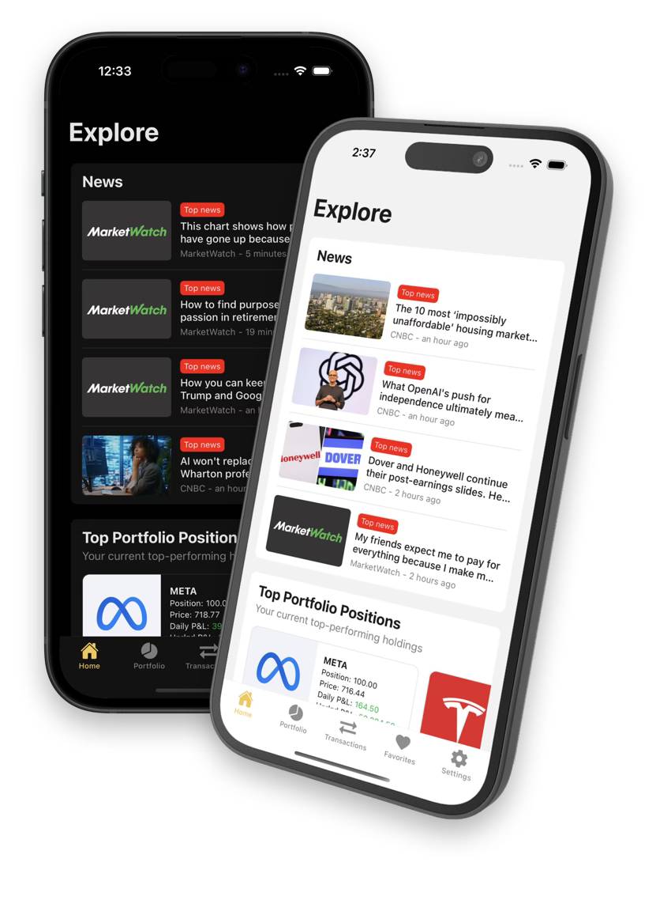
### Home Screen
The screen includes market news and the user's top portfolio positions, which help users better understand market trends and their own investments.

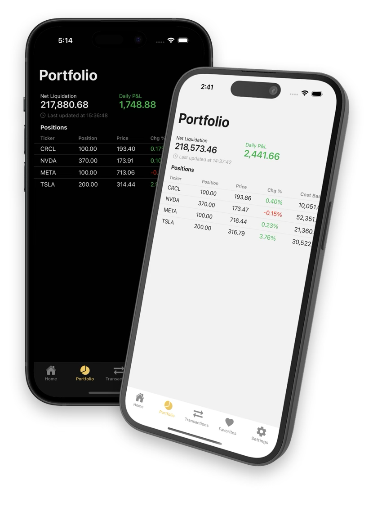
### Portfolio Screen
The screen displays detailed information about the user's current holdings, including current price, today's high and low, cost basis, prior close, daily change and percentage, market value, as well as today's and unrealized profit or loss.

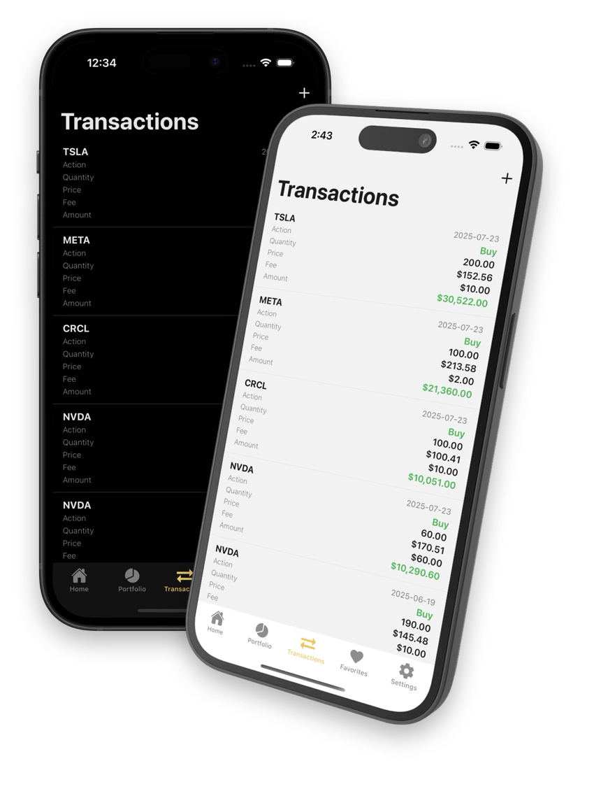
### Transaction Screen
The screen shows all transactions for the current user, including transaction details such as action, quantity, price, fee, amount, and date.

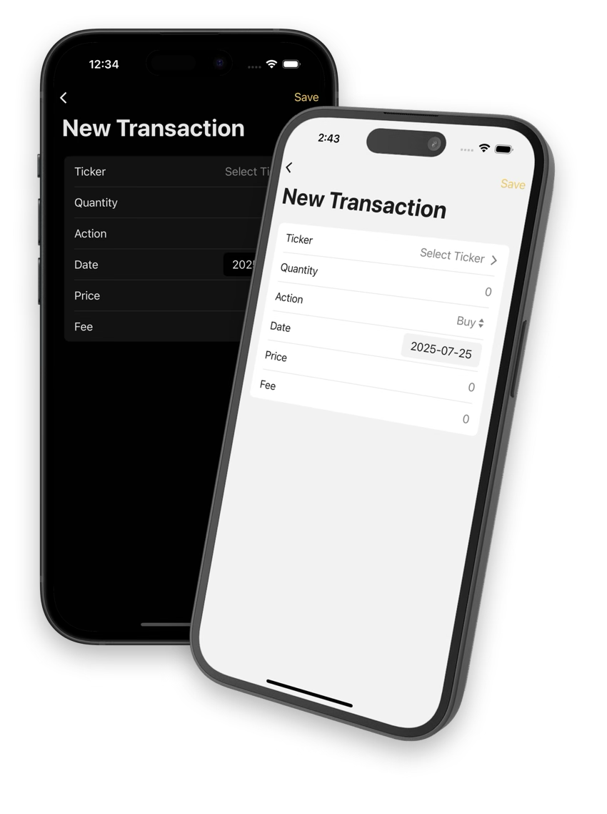
### Add Transaction Screen
The screen allows users to manually add transactions through our intuitive UI.

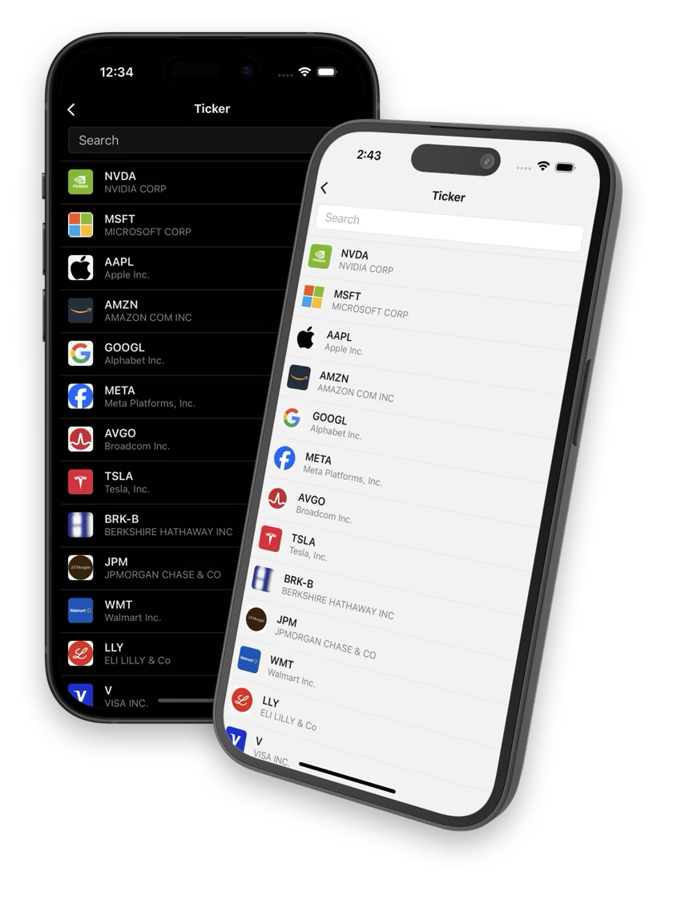
### Ticker List Screen
The screen displays all supported tickers with their logos and includes a search bar at the top to help users find tickers quickly.

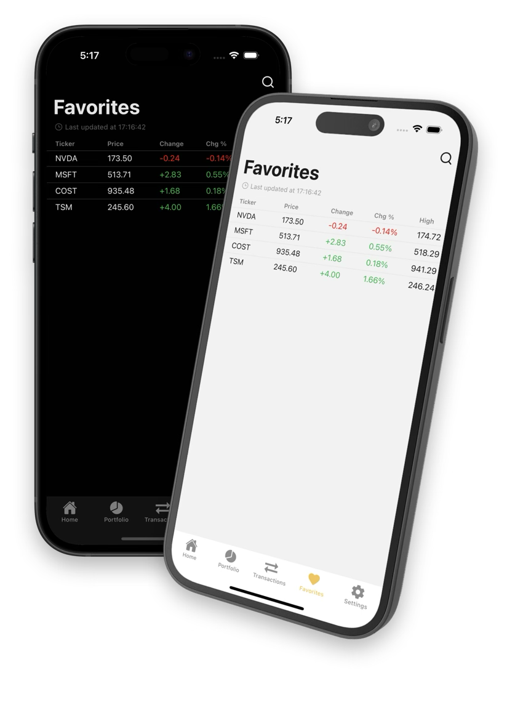
### Favorites Screen
The screen provides quick access to stocks that the user has marked as favorites for easier monitoring, including current price, change, today’s high and low, and prior price.

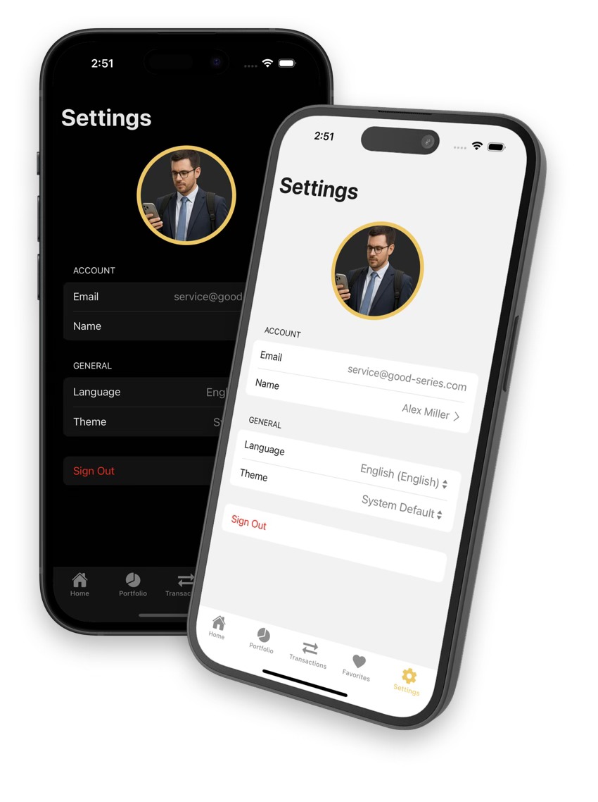
### Settings Screen
The screen displays user information including email, allows the user to update their display name and avatar, choose language preference (e.g., English, Traditional Chinese, Simplified Chinese, Hindi) and theme settings (e.g., light/dark), and provides a log out button.

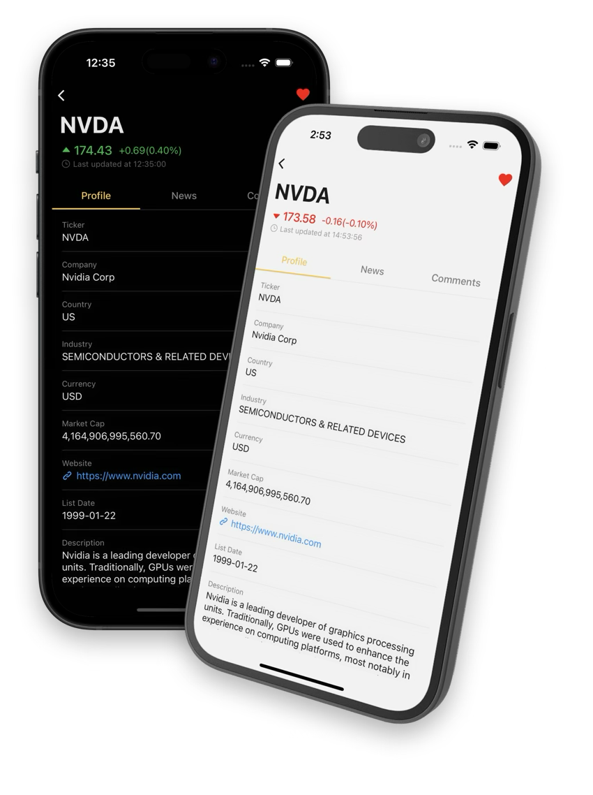
### Ticker Profile Screen
The screen displays information about the ticker, such as company name, country, industry, currency, market capitalization, website, listing date, and description.

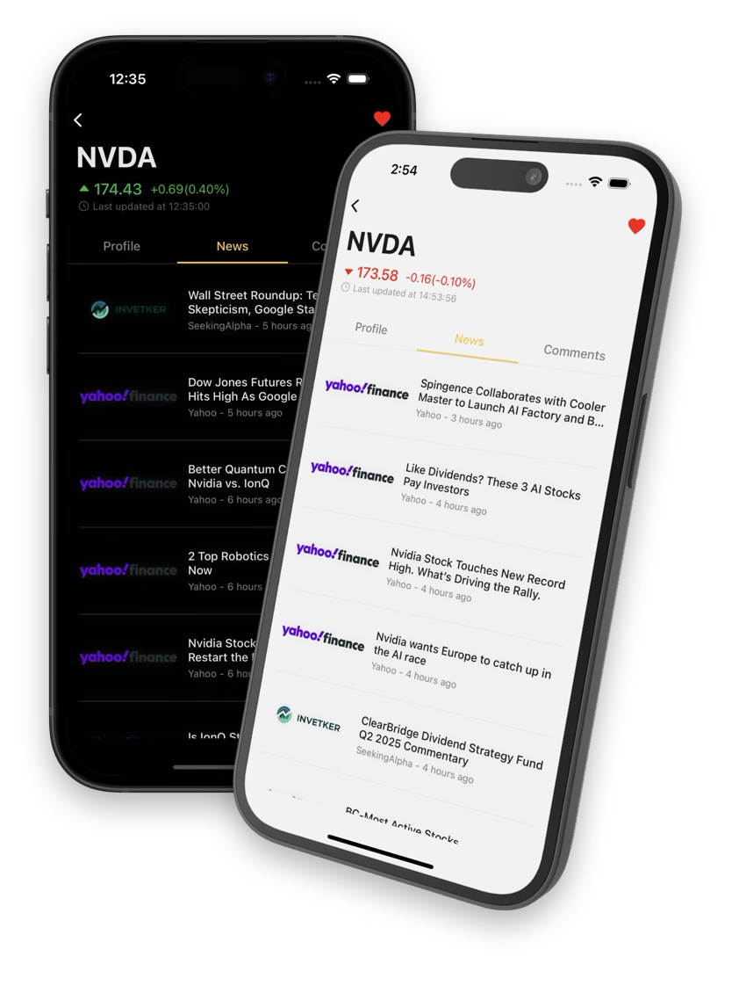
### Ticker News Screen
The screen displays news about the ticker, allowing users to quickly analyze its trend.

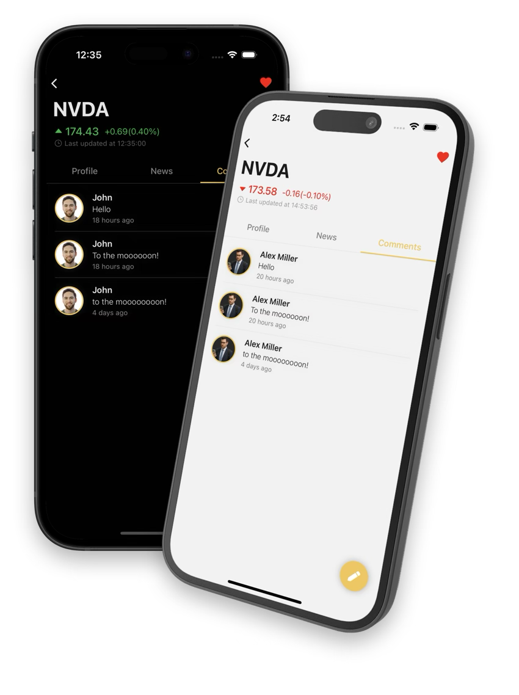
### Ticker Comments Screen
The screen showcases all comments related to the ticker, allowing users to gain new insights and helping them to better understand market sentiment.

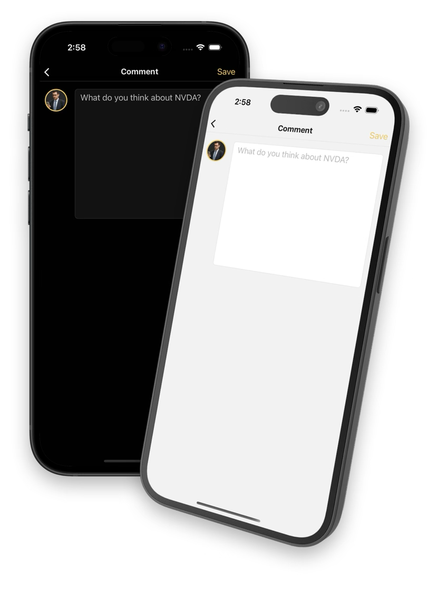
### Add Ticker Comment Screen
The screen allows users to share their thoughts on the ticker, such as its trend and performance, which can be helpful for others.

## References & Project Links

- [Finnhub API Documentation](https://finnhub.io/docs/api)
- [Polygon.io API Documentation](https://polygon.io/docs)
- [Gravatar Documentation](https://gravatar.com)
- [Logo.dev Documentation](https://logo.dev)
- [Firebase Documentation](https://firebase.google.com/docs)
- [React Native Documentation](https://reactnative.dev/docs/getting-started)
- [Expo Documentation](https://docs.expo.dev)
- [TypeScript Documentation](https://www.typescriptlang.org/docs)
- [Figma Design File](https://www.figma.com/design/9KWybwFlFMnBry58EdXhuc/INVETKER?node-id=56-31&t=UF4HVS1iAsInW8B6-1)